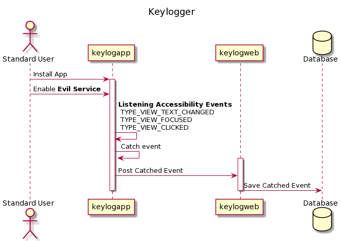

# Android Keylogger
* keylogapp => Basic Mobile Application that logs keys
* keylogweb => Web Application that receives logged keys

## How To Work
This is a project implemented as Project for the Information Systems Security Course. The main idea is developing a basic key logger for android mobile devices.

## How It Works

## Usage
1. First you need to build and install **keylogapp** to your Android phone
2. Second, you should run **keylogweb** application
    * NOTE: your andorid phone must have access to the server that web application running via network or internet etc.
3. Then, you can check your browser and you will see that each key-press on your Android phone will be printed to the web-page
